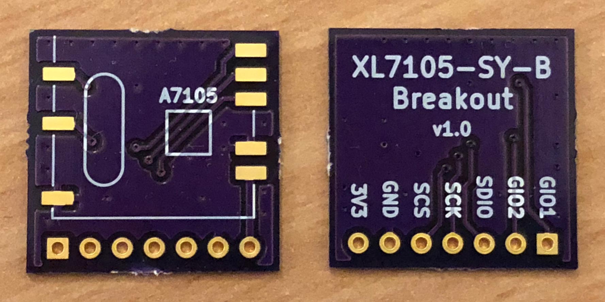
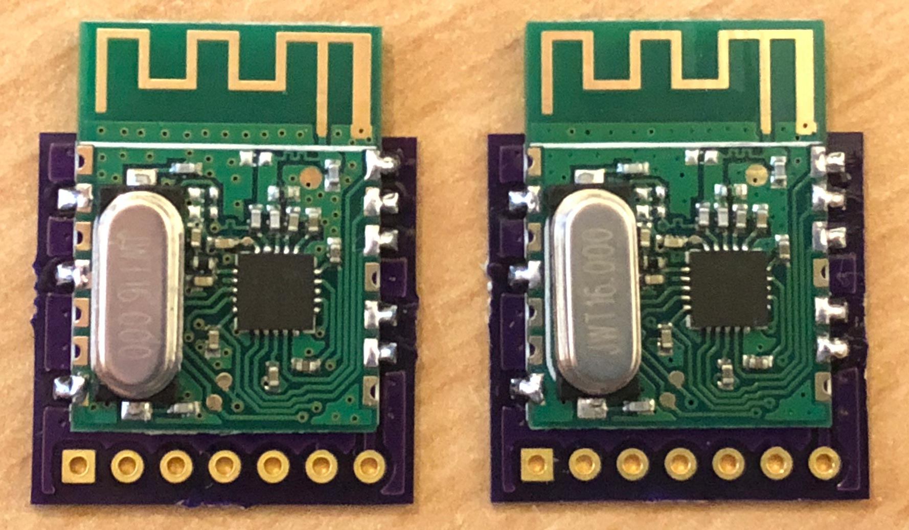
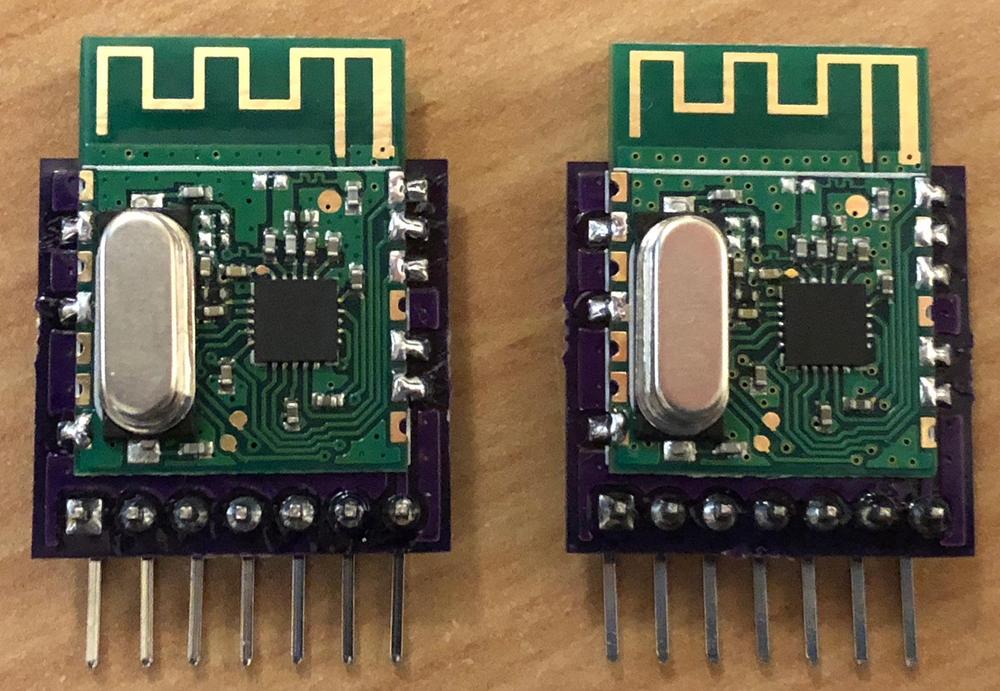
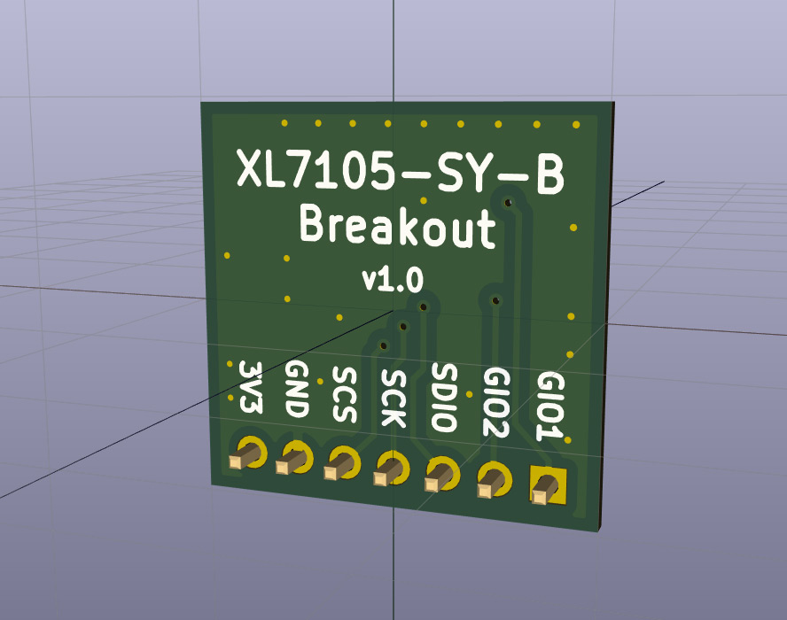
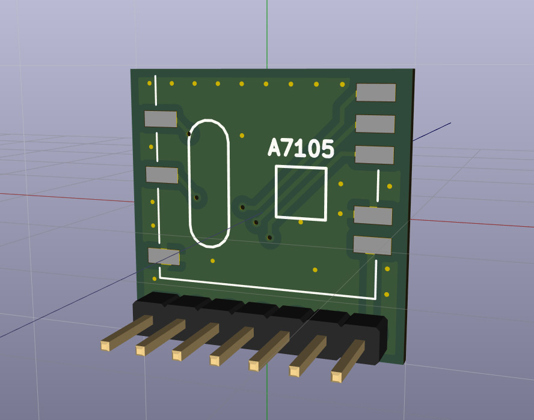
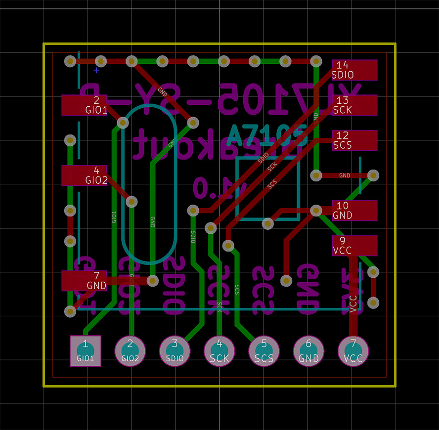
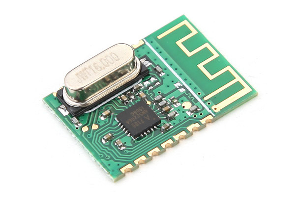
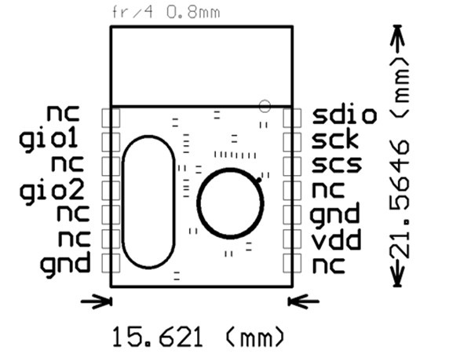

# XL7105-SY-B Breakout

Breakout board for the [XL7105-SY-B 2.4GHz RF transceiver module](https://www.aliexpress.com/item/MD7105-SY-A7105-2-4G-Wireless-Transceiver-Module-3-3V-Better-Than-CC2500-NRF24L01/32810870556.html).

Sometimes sold under the name MD7105-SY and features the [AMICCOM A7105 transceiver](http://www.amiccom.com.tw/asp/product_detail.asp?CATG_ID=2&PRODUCT_ID=64).

Order the board from OSH Park here: <https://oshpark.com/shared_projects/TcscxbDi>

3x boards for $3.05 (2 oz copper, 0.8mm thickness)

Only component you need is 1x7 straight or right-angle 2.54mm headers.

Designed using [KiCad](http://kicad-pcb.org/).

# OSH Park Purple PCBs

# Models

# PCB

# XL7105-SY-B module

# Links

* [XL7105-SY-B 2.4GHz RF transceiver module](https://www.aliexpress.com/item/MD7105-SY-A7105-2-4G-Wireless-Transceiver-Module-3-3V-Better-Than-CC2500-NRF24L01/32810870556.html)
* [Order the board on OSH Park](https://oshpark.com/shared_projects/TcscxbDi)
